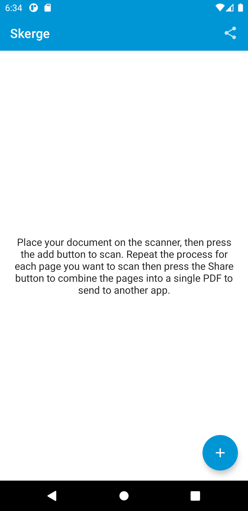

# Skerge

Skerge is an app I wrote to make scanning multiple pages into a single file less painful with my
scanner. I wrote a [blog post](https://wbrawner.com/2021/07/08/skerge/) about it in case you're
interested in reading more.

## Screenshots

